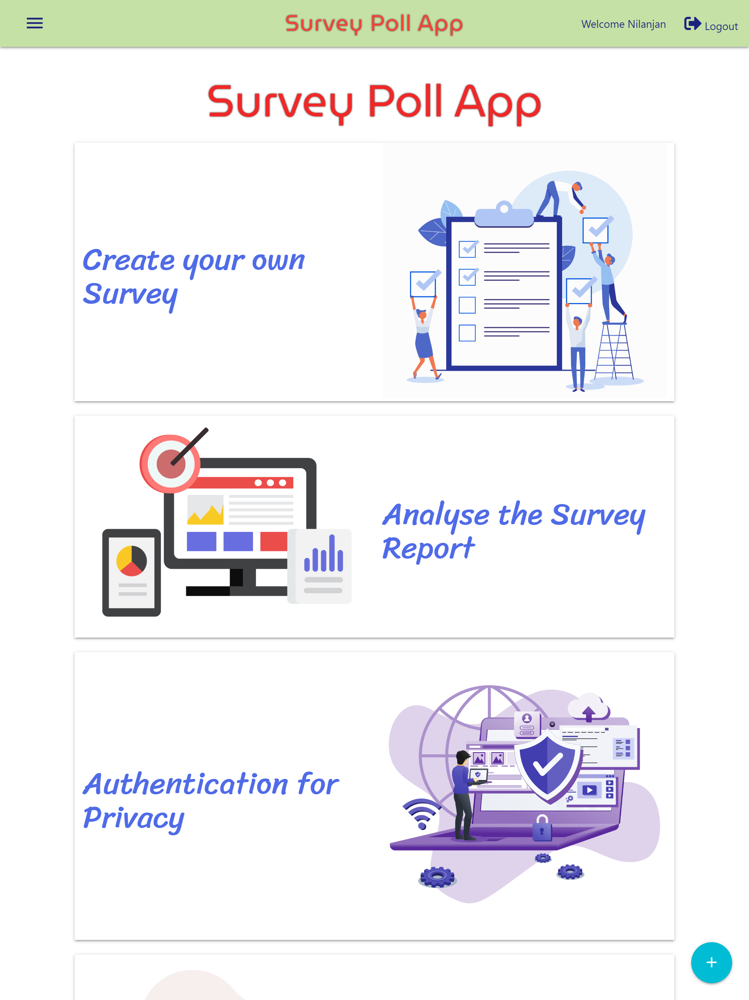
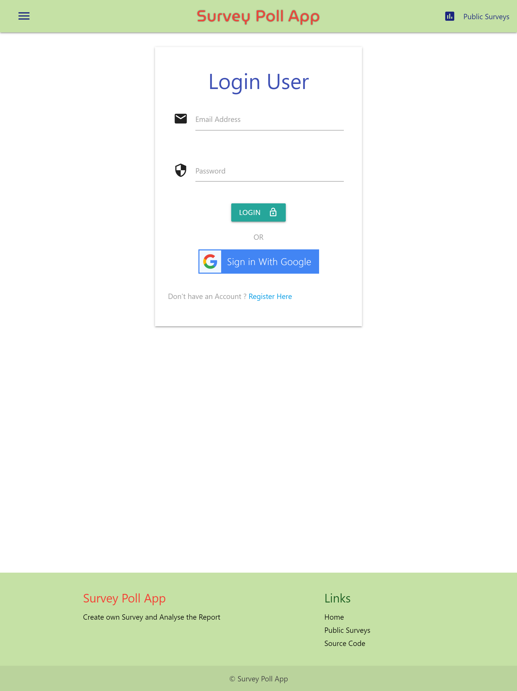
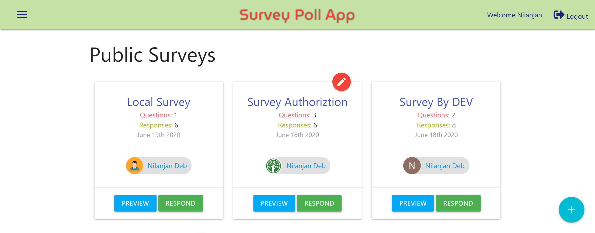
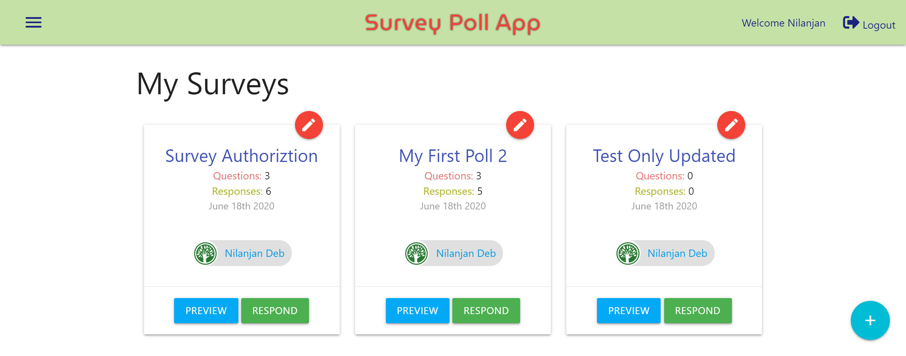
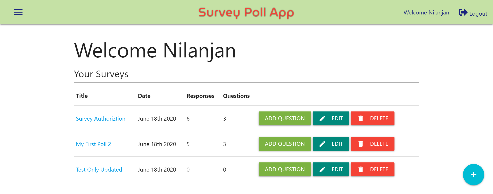
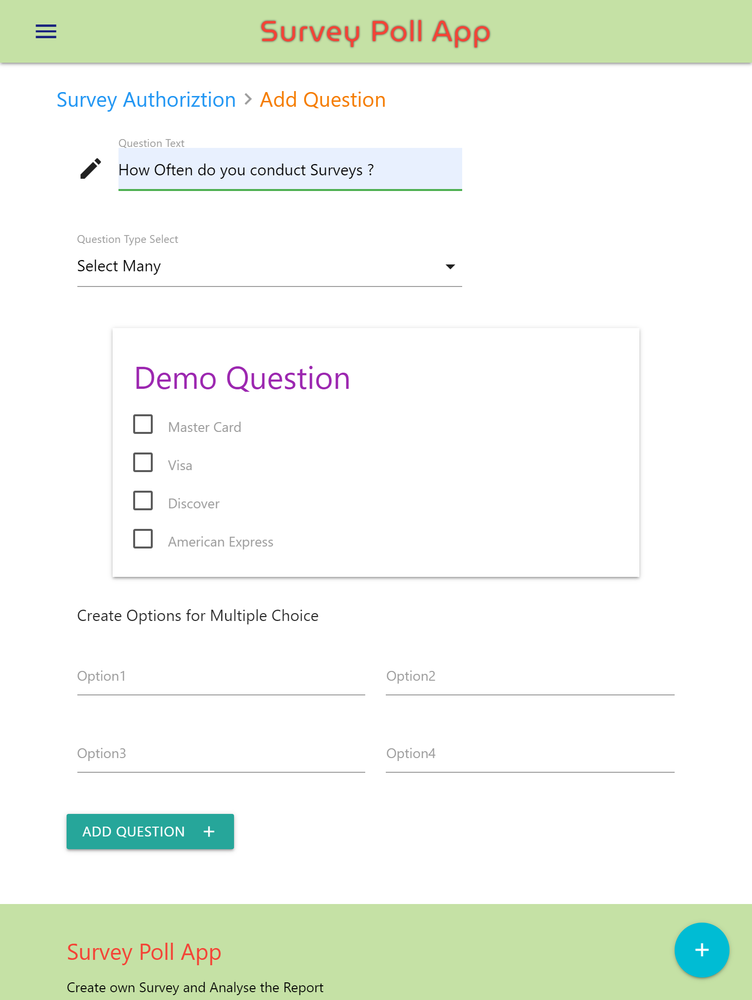
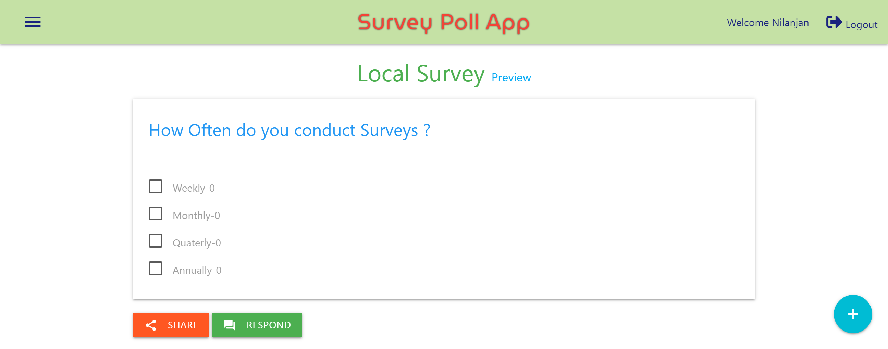

# Survey Creator App
* #### This site is live [here](https://poll-node.herokuapp.com/).
* #### Github Repository [link](https://github.com/nil1729/poll-app).

---
## Features of the Project 

* ### Frameworks or Languages:
1. *`NodeJS`* is used for building Backend part of this Website.
2. *`MongoDB`* used for Database to store data.
3. *`ExpressJS`*  is used as Backend Framework.
4. *`Materialize-CSS`* is used for CSS Framework and the website is Responsive for all Devices.
5. *`ChartJS`* is used for Charting the responses and Data.

---

* ### Authentication for Users:
1. *`PassportJS`* is used for Authentication purpose.
2. Two types of Strategy is used in this Website. (viz. [Local Strategy] and [Google oAuth Strategy]).
3. User can Register via `Google` or by submitting `Email` and `Password` as Standard Login.

----

* ### Survey Create and Manage:
1. Only logged in user can create a Survey.
2. Completely newly created `Survey` will have no question on it initially
3. Only Survey owner can added question to Survey.
4. Only survey owner can view the analysis of his survey.
5. Only those surveys show on `Public Surveys` section which has atleast `one` question.
6. In `My Surveys` section an user can view all of his surveys.
7. There have total 7 types of feedback Question (eg. Multiple Choice, Yes/No, slider, Select Many, Like-Dislike, Emoji Feedback, Star Rating etc. and also has a `Comment Box` feature.)
8. In User `Dashboard`, an user can `Delete` , `Update` and `Add Question` to a Survey.

---

* ### Analysis of Survey
1. *`ChartJS`* is used for charting the Data got from Responses of a Survey.
2. Two types of Chart is used. One is `Bar Chart` and another is `Doughtnut`.
3. Easily Understandable to all users.

---

* ### Security
1. Encrypt passwords.
2. Prevent cross site scripting - XSS.
3. Prevent NoSQL injections.
4. Add a rate limit for requests of 50 requests per 10 minutes.
5. Protect against http param polution.
6. Add headers for security (helmet).
7. Use cors to make API public.

---

## Website Preview
* ### `Home` Page ( Describe the features )
    
* ### `Login and Resgister` Page ( For Authenticating Users ).
    
* ### `Public Surveys` Page ( Show all surveys which atleast have one Question ).
    
* ### `My Surveys` Page ( Show all of your Surveys either it has atlest one Question or not ).
    
* ### `Dashboard` ( User can manage all CRUD operation here in one single page).
    
* ### `Add Question` Page ( Add Question to a particular Survey ).
    
* ### `Preview and Response` Page ( Show the particular survey with all of its Questions ).
    
* ### `Analysis` Page ( Show analysis of responses and Charts for a particular Survey ).
    

---

Made With &#10084; by <a href="https://github.com/nil1729" target="_blank"> Nilanjan Deb </a> 
